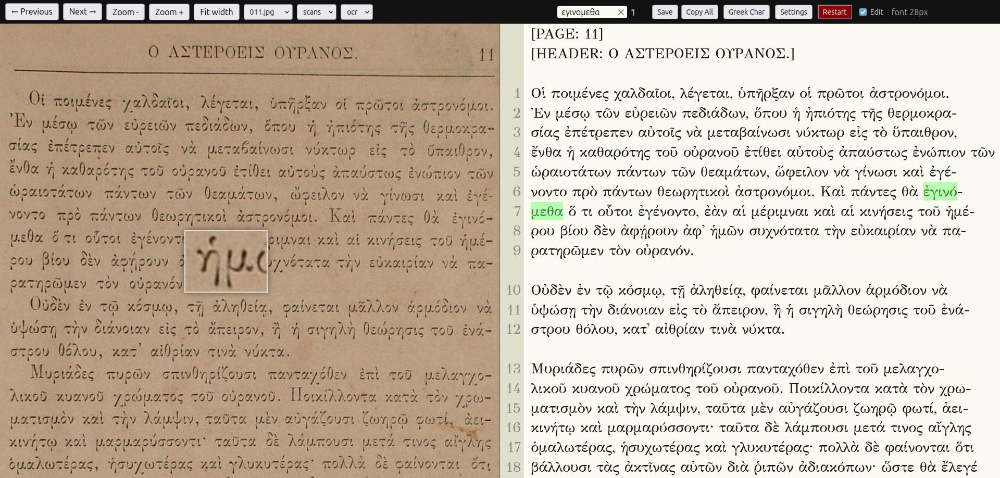

# Polytonic Proofreader (But easily convertible to other scripts, see below)

A browser-based polytonic Greek OCR proofreader.

> Originally created for proofreading **ΤΟ ΣΥΜΠΑΝ (THE UNIVERSE)** (Smyrna, 1888) —
> a family heirloom the author wanted to digitise and read.
> The TCP port `1888` is the year of printing of this specific book. Although it is still
> a Greek polytonic proofreader, it can easily (almost instantly with an AI) be converted
> to another script



## Rationale
Already in the research phase digitising the book, it was obvious that a dedicated proofreader/editor
was needed:
- Web-based (inside the browser) to reduce the friction of switching tasks to a minimum. One tab for the AI OCR extractor next to the proofreader tab.
- Only one script (polytonic Greek in this case). It would add unnecessary friction for such a hard job to support more at the same time.
- Single file so it can easily be converted (with AI) to another script
- Having specific advanced capabilities, allowing for example to look for misspelled words or words spanning two lines (common in old books), or a magnifying glass. At the same time, very common functionality (search and replace for example) is omitted, as not useful for this task.
- Minimal and easy customisation.
- Preventing common and detrimental mistakes, like saving modern Greek text to the polytonic `ocr` folder, or saving polytonic text to the `el` folder.
- Allowing to write Greek characters without even switching to a Greek keyboard. Additionally the character palette allows typing accents and the rest.
- Oriented only for proofreading; the bulk of the text comes from OCR (AI). The project includes the [`gemini-prompt.txt`](gemini-prompt.txt) I have used. 
- Written by the `person who used it`. This feedback loop can create software no generic program can match. Of course this means `another` person might dislike it, but as we have said it is a single-file program. Open an AI (web-based, or a coding agent) dialogue and say what you want.


## Setup & Workflow
- **Download the repo** locally on your PC. Inside the repo folder, create a folder `my_book` (the book title).
- **Place page images** — inside `my_book/scans/`, put your scanned page images (JPG, PNG, WebP, GIF, TIF).
- **Install Go**:
   ```bash
   # Debian / Ubuntu
   sudo apt update && sudo apt install golang-go
   ```
- **Run the proofreader**:
   ```bash
   go run proofreader.go my_book
   ```
- **Open** the link the proofreader shows in a browser tab.
- **Get OCR text from an AI vision model** — in a nearby browser tab, feed each scan image to an AI vision model (e.g. Gemini, GPT‑4o, Claude) together with a prompt instructing it to output polytonic Greek. Copy the returned OCR text.
- **Navigate to the page** — use the **← Previous** / **Next →** toolbar buttons to go to the page you just processed.
- **Paste the OCR** — paste the AI's output into the text pane on the right.
- **Proofread** — compare the scan image (left) against the text (right). Use the **accent‑ignoring search** (Ctrl+F) to spot-check dubious words, and the **Greek character palette** (Ctrl+P) to type corrections. The AI vision model can also suggest what to check again — follow its recommendations.
- **Read and annotate** — the purpose is not just to correct OCR errors, but to actually **read the book** as you go. Add comments for small errors in the original text, noteworthy topics, or anything that catches your interest — inside brackets like `[λέξη: επεξήγηση]` or as plain notes. These annotations persist in the saved text.
- **Save and move on** — press **Save** (Ctrl+S) and repeat for the next page. Unsaved changes show a `*` in the browser tab title.


## Book structure

The program discovers scans and text directories by scanning the project directory you pass as argument. Here's how it works:

### Scan directories

Any **subdirectory whose name starts with `"scans"`** is treated as a scan directory:
- `scans` — primary scan folder
- `scans2`, `scans_backup`, etc. — additional scan sources

The folder named exactly `scans` is always listed first. You can switch between them using the **source dropdown** in the toolbar.

### Accepted image formats

Only files with these extensions are recognised as page images:
`.jpg`, `.jpeg`, `.png`, `.webp`, `.gif`, `.tif`, `.tiff`

Non-image files and nested subdirectories are ignored.

### Text (OCR) directories

The program looks for folders named exactly `ocr` and `el` (no prefix matching) under the project directory. These store the OCR text files — one `.txt` file per page.

If neither `ocr` nor `el` exists, the program **automatically creates** `ocr/` after validating that the scans structure is present.

### Example layout

The repo comes with ready-to-use examples in the [`examples/`](examples/) directory:

```
project/
├── scans/                # page images (jpg, png, webp, gif, tif)
│    ├── 048.jpg
│    ├── ...
├── ocr/                  # OCR text files (one per page)
│    ├── 048.txt
│    └── ...
└── el/                   # modern Greek OCR text (optional)
     └── 048.txt
```

Run `go run proofreader.go examples` to try it immediately (use `-p 1889` to pick a different port).

### Custom layout

Pages sharing the same 3‑character prefix (e.g. `011.jpg`, `011b.jpg`) are grouped together. Use the **source dropdown** to switch between image variants while keeping the same text.

### Configuration

There are **no environment variables, no config files** for paths — it's all filesystem-based with the hardcoded `"scans"` prefix as described above.

### Port

The server runs on port **1888** by default. Use the `-p` / `--port` flag to change it:

```bash
go run proofreader.go -p 1889 examples
# Open http://localhost:1889/
```

## Quick start

```bash
# Try it with the built-in examples
go run proofreader.go examples
# Open http://localhost:1888/

# Or use your own project
go run proofreader.go /path/to/project

# Use a different port, for tests, or having 2 books in different tabs
go run proofreader.go -p 1889 /path/to/project
```

## Features

### Side-by-side view
- **Left pane** — scan image (wheel to scroll vertically, **Ctrl+wheel** to zoom, click-drag to pan, double-click to fit/zoom)
- **Right pane** — editable OCR text with wheel to scroll, **Ctrl+wheel** to change font size

### Edit mode
Click **☐ Edit** (or **Ctrl+E**) to toggle between:

| Mode | Behaviour |
|---|---|
| View | Drag‑scroll text, font resize via scrollwheel, read‑only |
| Edit | Type corrections, click for cursor, undo/redo work |

### Polytonic Greek character palette
Click **Greek Char** (or **Ctrl+P**) to open a popup with all accented/breathing‑mark variants. Click any character to insert it at the cursor position. The leftmost column (the bare letter) is also clickable — you can insert `α` without switching your keyboard.

**Undo (Ctrl+Z) works** for palette insertions and direct typing.

### Latin → Greek transliteration ("Force Greek")
When **☐ Force Greek** is checked (default), both the **search box** and the **text area** automatically convert Latin letters to their Greek QWERTY equivalents as you type:

<table>
<tr><th>English key</th><th>→</th><th>Greek</th><th style="width:2em"></th><th>English key</th><th>→</th><th>Greek</th></tr>
<tr><td>a</td><td>→</td><td>α</td><td></td><td>n</td><td>→</td><td>ν</td></tr>
<tr><td>b</td><td>→</td><td>β</td><td></td><td>x</td><td>→</td><td>χ</td></tr>
<tr><td>g</td><td>→</td><td>γ</td><td></td><td>o</td><td>→</td><td>ο</td></tr>
<tr><td>d</td><td>→</td><td>δ</td><td></td><td>p</td><td>→</td><td>π</td></tr>
<tr><td>e</td><td>→</td><td>ε</td><td></td><td>r</td><td>→</td><td>ρ</td></tr>
<tr><td>z</td><td>→</td><td>ζ</td><td></td><td>s</td><td>→</td><td>σ</td></tr>
<tr><td>h</td><td>→</td><td>η</td><td></td><td>t</td><td>→</td><td>τ</td></tr>
<tr><td>u</td><td>→</td><td>θ</td><td></td><td>y</td><td>→</td><td>υ</td></tr>
<tr><td>i</td><td>→</td><td>ι</td><td></td><td>f</td><td>→</td><td>φ</td></tr>
<tr><td>k</td><td>→</td><td>κ</td><td></td><td>c</td><td>→</td><td>ψ</td></tr>
<tr><td>l</td><td>→</td><td>λ</td><td></td><td>v</td><td>→</td><td>ω</td></tr>
<tr><td>m</td><td>→</td><td>μ</td><td></td><td>q</td><td>→</td><td>ς</td></tr>
<tr><td></td><td></td><td></td><td></td><td>j</td><td>→</td><td>ξ</td></tr>
</table>

Uncheck to type Latin letters normally. The setting persists across page changes and browser refreshes via `localStorage`.

### Search
The search field finds polytonic Greek text, **ignoring accents and breathing marks**. Typing `καλος` also matches `καλός`, `καλῶς`, etc. Search is hyphenation‑aware: line‑break hyphens (`-\n`) are skipped during matching.

### Copy All
Click **Copy All** to copy the entire current page text to your clipboard. Shows a confirmation in the status bar.

### Digraph matching (experimental)
When **☐ Digraph matching** is checked (default: **on**), the search engine also matches historical spelling variants:
- ει matches η, ι, υ (all pronounced similarly in later Greek)
- αι matches ε
This helps find words that may have been spelled with different vowel letters in the original text vs. the OCR output.

### Magnifier
Hover over the scan image to see a **3× magnified lens** that follows your cursor — useful for checking small diacritics and breathing marks in polytonic Greek. The magnifier can be toggled on/off:

- **Settings popup** — check ☐ Always-on magnifier
- **Middle-click** on the image pane — quickly toggle the magnifier on or off
- **Ctrl+M** — keyboard shortcut to toggle

When the magnifier is off, the cursor changes back to a grab-hand for panning.

### Line numbers
In **Settings**, toggle **☐ Lines** to show/hide line numbers on the left side of the text pane. Lines that are blank or contain only metadata (e.g. `[header]`) are skipped by the numbering.

### Image source selector
Use the **source dropdown** (between the page selector and the text source) to switch between multiple scan directories — e.g. `scans` (primary) and `scans2` (alternative/cleaner images of the same pages).

### Text source selector
Use the **text source dropdown** (next to the image source) to switch between multiple OCR sources — e.g. `ocr` (polytonic Greek) and `el` (modern Greek). This allows comparing or saving to different text directories.

### Settings
Click **Settings** (no shortcut) to open a popup with the following toggles:

| Setting | Default | Description |
|---|---|---|
| ☐ Lines | On | Show/hide line numbers in the text pane |
| ☐ Always-on magnifier | Off | Keep the magnifier visible while hovering the image |
| ☐ Force Greek | On | Auto-convert Latin letters to Greek in the text area and search box |
| ☐ Digraph matching | On | Match historical spelling variants during search |
| ☐ Restart button | On | Show/hide the Restart button in the toolbar |
| ☐ Edit enabled by default | Off | Start every page in edit mode instead of view mode |
| ☐ Auto-save (30s) | On | Automatically save the current page every 30 seconds when modified |

All settings persist across page changes and browser refreshes via `localStorage`.

### Help
Click **Help** (no shortcut) to view a popup with a full reference of image-pane interactions, text-pane interactions, and global keyboard shortcuts.

### Server restart (hot‑reload)
After editing the Go source, click the **Restart** button (or visit `/restart`) to recompile and restart the server in-place. The browser automatically refreshes after 1 second — no need to restart the terminal command. The button is disabled if Go or the source file is not found.

## Keyboard shortcuts

| Shortcut | Action |
|---|---|
| **Ctrl+E** | Toggle edit mode |
| **Ctrl+F** | Focus search box |
| **Ctrl+G** | Toggle Force Greek |
| **Ctrl+M** | Toggle magnifier |
| **Ctrl+D** | Toggle digraph matching |
| **Ctrl+P** | Open Greek character palette |
| **Ctrl+S** | Save current page |
| **Ctrl+Z / Y / Shift+Z** | Undo / redo (native browser, always works) |
| **Escape** | Close Greek palette |

## Project structure

```
├── proofreader.go       # single‑file Go server + embedded HTML/CSS/JS
├── README.md
├── .gitignore
├── reasonix.toml        # AI coding agent configuration
├── gemini-prompt.txt    # prompt used with AI vision models for OCR
├── screenshot.jpg       # screenshot for the README
└── examples/            # ready‑to‑run sample scans + OCR text
    ├── scans/
    ├── ocr/
    └── el/
```

No dependencies beyond the Go standard library. No `go.mod`, no build step — just `go run`.

## Why there is no need for binaries

This program is distributed as **source code only** — no precompiled binaries, no installers. You get the Go compiler, and you're ready to go.

### The real reason: customisation

The book you are digitising is **unique**. Its script, its layout, its quirks — no binary could anticipate them all. By keeping the program as a single editable source file, you — or any AI coding agent — can:

- **Change the character palette** — add or remove diacritic combinations specific to your book's orthography
- **Adapt the transliteration map** — re-map keyboard keys for your script's letters
- **Tweak the search behaviour** — add or remove digraph equivalences for historical spellings
- **Modify the save logic** — add book-specific metadata headers or annotation conventions
- **Add entirely new buttons** — anything from "Insert page number" to "Export to Markdown"

Everything is in one file, every feature is a few lines of JavaScript or Go away from being changed. No build tools, no recompilation step — just edit, save, and click **Restart**.

## Forking for another script

The **Go server is script-agnostic** — only the embedded frontend (character palette, transliteration map, text detection) is script-specific. To adapt this tool for Arabic, Hebrew, Cyrillic, or any other writing system:

1. **Copy** `proofreader.go` → `your-fork.go`
2. **Give it to an AI** — paste the file into any code agent (Claude, GPT, Gemini) or web AI chat tool and tell it what script you need. Since everything is in one self-contained file with clear section markers, the AI will understand the structure and make the changes.
3. **Run** with `go run your-fork.go /path/to/project`.

No Go dependencies beyond the standard library, no build step — just Go installed.

---

> Developed with the assistance of **Reasonix Code (Deepseek V4)**, an AI coding agent.
> The design, workflow, and feature decisions were made by the author;
> the agent translated them into code.

## License

MIT. Do what you want with it.
